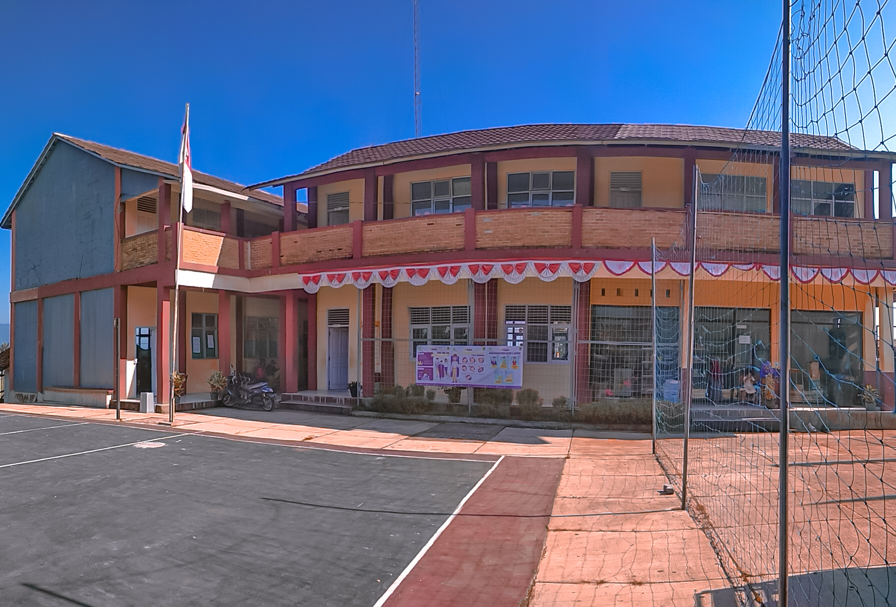
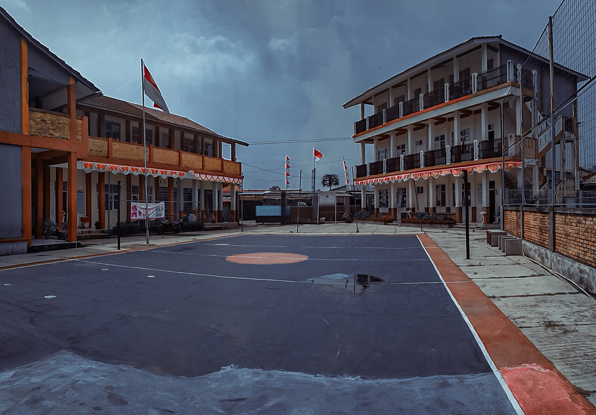

<!DOCTYPE html>
<html lang="id">
<head>
    <meta charset="UTF-8">
    <meta http-equiv="X-UA-Compatible" content="IE=edge">
    <meta name="viewport" content="width=device-width, initial-scale=1.0">
    <title>FarsKer</title>
    <link rel="stylesheet" href="style.css">
</head>
<body>

  <a class="active" href="#home">Home</a>
  <a href="news.html">News</a>
  <a href="contact.html">Contact</a>
  <a href="about.html">About</a>
  

  <header class="bgh">
      

          <header class="bgh1">
              
              
              <h1>SMK BUMI PUTERA</h1>
              
              
           </header>
          
      

  </header>
